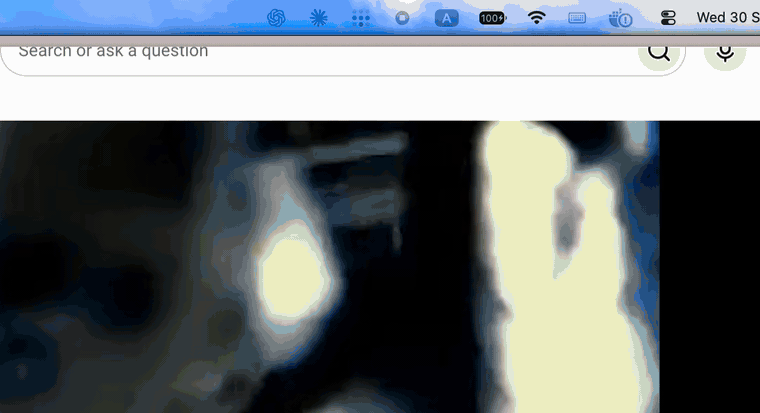

# NotchPilot

A free, open-source notch island for MacBooks with a notch, in the spirit of Alcove.
Hover the notch and it opens with spring motion. Only the shape animates; the window
never moves, so the motion stays smooth.



## Features

- **Now Playing** from the system media tracker: artwork, play/pause, next/previous,
  scrubbing. Works with any app or browser tab that shows up in Control Center.
- **Switch between the things you actually listened to.** Anything that played for more
  than 30 seconds becomes a chip. One click pauses what's playing now and resumes that tab
  or app, so there's no hunting through browser tabs. Short clips never show up.
  Supports tabs in Arc, Chrome, Brave, Edge and Dia (YouTube, YouTube Music, Deezer,
  Spotify Web, SoundCloud and generic players), plus Spotify and Music.
- **Collapsed wings** while something plays: tap the artwork to jump to its source,
  tap the equalizer to pause or resume.
- **Audio output** in one tap: only Bluetooth headphones and the built-in speakers,
  no virtual-device clutter. **⌃⌥⌘O** switches from anywhere and flashes the device
  name in the notch.
- **Per-app volume mixer** via Core Audio process taps. Apps left at 100% are never tapped.
- **Hidden in fullscreen**: no playback animation over videos or games unless you
  deliberately hover the notch.
- Optional quick toggles:
  - **XDR brightness** if [BrightIntosh](https://github.com/niklasr22/BrightIntosh) is installed.
  - **Fans max/auto** with a small root helper (see below). No fan-control app needs to
    stay in the menu bar.

## Requirements

A MacBook with a notch (Apple silicon), macOS 15 or later.

## Install

Grab `NotchPilot-x.y.zip` from Releases, unzip it and move `NotchPilot.app` to
Applications. The build is not notarized, so macOS blocks the first launch. Open it
anyway from System Settings → Privacy & Security, or run:

```bash
xattr -dr com.apple.quarantine /Applications/NotchPilot.app
```

Right-click the island for Launch at Login and Quit.

### Build from source

```bash
git clone https://github.com/VelizarSeleznev/NotchPilot.git
cd NotchPilot
script/build_and_run.sh
```

This needs the Xcode command line tools. The app is signed with your first Apple
Development identity if you have one, otherwise ad-hoc, and installed to
`~/Applications`. With ad-hoc signing macOS asks for permissions again after every
rebuild.

### Fan control (optional)

```bash
script/install_fan_helper.sh            # asks for your password once
script/install_fan_helper.sh uninstall
```

The helper is a root LaunchDaemon built from [Stats](https://github.com/exelban/stats)' SMC code.
It watches `/Users/Shared/NotchPilot/fan-mode` (`max` / `auto`), sets the fans and writes
`fan-status` next to it. The Fans button appears once the helper is installed. NotchPilot
re-applies Max after wake. Quit other fan-control apps so they don't fight over the SMC.

## Permissions

macOS asks for each one the first time it's needed:

- **Automation → your browser**, to find, pause and resume media tabs. For Chrome-based
  browsers, enable View → Developer → Allow JavaScript from Apple Events.
- **Screen & System Audio Recording**, for the per-app volume mixer only.

## How it works

- Since macOS 15.4, MediaRemote only answers Apple-signed processes. A tiny ObjC bridge
  (`Bridge/`) is loaded into `/usr/bin/perl`, streams Now Playing as JSON lines and takes
  commands on stdin. This is the trick popularized by
  [mediaremote-adapter](https://github.com/ungive/mediaremote-adapter).
- Browser tabs are matched to the system tracker by probing `document.title` and
  `navigator.mediaSession` over AppleScript, then paused and resumed with small
  site-specific scripts.
- Fullscreen detection uses the private SkyLight space type (fullscreen Spaces sit below
  the notch, so window bounds alone don't work).
- The hot key uses Carbon `RegisterEventHotKey`: no Accessibility or Input Monitoring
  permission and no event tap.

It relies on private APIs and may break with a macOS update. Debug log:
`~/Library/Logs/NotchPilot.log`.

## Local API

Other local processes can drive NotchPilot over `DistributedNotificationCenter`
(payload in the notification `object` as a String). This is how a phone remote can
be bridged in.

- Commands: `com.velizard.NotchPilot.command` with `play`, `pause`, `toggle`, `next`,
  `previous`, `seek:<seconds>`, `volume:<0...1>`, `volumeStep:<±delta>`,
  `mute:toggle|true|false` or `publishNowPlaying`.
- State: `com.velizard.NotchPilot.nowPlaying` with JSON containing title, artist, album,
  source, playing, duration, elapsed (at `sampledAt`), artworkKey, artworkPath (JPEG), and
  the default output's volume, muted and output name. It's posted on every change.

## Companion apps

The grid button to the right of the notch opens an Apps page. It controls the author's own
menu bar utilities (CapturePop, Pixel Clipboard, BrightIntosh) over distributed
notifications when they're installed, and otherwise only shows NotchPilot's own settings.

## License

MIT. `FanHelper/smc.swift` is from Stats (MIT, © Serhiy Mytrovtsiy).
